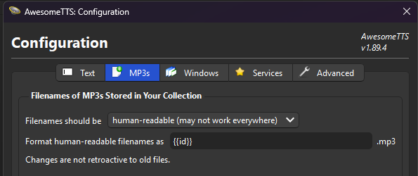
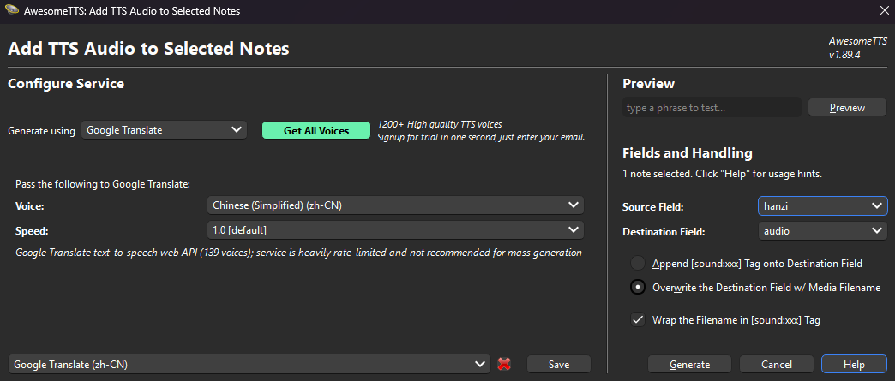

# Mandarin Anki Deck

This repository contains the **source of truth** for a custom Mandarin Anki deck.

- Notes are stored in a Git-friendly TSV file: `deck/notes.tsv`
- Card templates + CSS are versioned in Git under: `anki/note-type/`
- Media (optional) can be stored under `media/` and copied into Anki’s `collection.media`

## Design Goals

- Stable, unique IDs (safe re-import without losing scheduling)
- Git-friendly TSV source (easy to edit in VS Code)
- Real Anki tags (via the TSV `tags` column → mapped to Anki “Tags”)
- Optional audio & images
- Card templates and CSS versioned in Git
- Works on macOS, Windows, and iOS (with platform notes below)

---

## What the Cards Show

### Front

1. Hanzi
2. Pinyin
3. Audio:
   - Plays an audio file if the `audio` field contains `[sound:...]`
   - Otherwise uses **system TTS fallback** via `{{tts zh_CN:hanzi}}`
4. Image (optional, only shown if `image` field contains an ``)

### Back

1. Meaning
2. Example (optional)
3. Audio again (same logic)
4. Image (optional)

### Auto-play audio

Enable:

- `Tools → Preferences → Playback → Automatically play audio`

---

## Workflow

1. Edit `deck/notes.tsv` in VS Code
2. Import into Anki using the custom note type
3. Learn in Anki
4. Update TSV (or optionally edit fields in Anki)
5. Re-import with “Update existing notes” enabled

> This repository remains the **source of truth**.  
> If you edit notes in Anki, export/merge changes back into `deck/notes.tsv` to keep Git authoritative.

---

## Setup Guide (Anki)

You only need to do this **once per Anki profile**.

### Prerequisites

- Create (or choose) an Anki deck to import into (e.g. `Mandarin`).

---

## 1) Create a Custom Note Type

1. Open Anki
2. `Tools → Manage Note Types`
3. Click **Add**
4. Choose **Add: Basic**
5. Name it: `Mandarin (TSV)` (or similar)

> Note: We are not using “Basic (and reversed card)”.  
> We keep a single note type and control front/back via templates.

---

## 2) Configure Fields

With your note type selected:

1. Click **Fields**
2. Remove all existing fields
3. Add fields in this exact order:

   1. `id`
   2. `hanzi`
   3. `pinyin`
   4. `meaning`
   5. `example`
   6. `audio`
   7. `image`

✅ Important:

- Fields are **data containers**, not “front/back”.
- The “Front” and “Back” are defined in the **Cards** templates.
- Do **not** add a `tags` field: tags are handled separately by Anki during import.

Click **Save**.

---

## 3) Configure Card Templates + Styling

1. Select your note type
2. Click **Cards…**
3. Paste templates from this repo:

- Front Template: `anki/note-type/front.html`
- Back Template: `anki/note-type/back.html`
- Styling: `anki/note-type/style.css`

Click **Save**.

---

## 4) System TTS Fallback

The templates include a fallback when no audio file exists:

- If `audio` is present: play `[sound:...]`
- Else: use Anki’s built-in `{{tts ...}}`

### Platform notes

- **macOS:** usually works out-of-the-box (install Chinese voices if needed)
- **Windows:** you must install a Chinese TTS voice (see Troubleshooting)
- **iOS:** AnkiMobile does **not** support Anki’s `{{tts ...}}` tag.
  - iOS will only play audio if you provide `[sound:...]` files.

---

## 5) Import the TSV Deck

1. In Anki: `File → Import`
2. Select `deck/notes.tsv`

In the import dialog:

- Type: **Notes**
- Separator: **Tab**
- “Allow HTML in fields”: ✅
- Note Type: `Mandarin (TSV)`
- Deck: your deck (e.g. `Mandarin`)
- Existing notes: ✅ **Update existing notes**
- Match scope: (default is fine)
- “Fields separated by”: Tab

### Field mapping

Map TSV columns like this:

| TSV Column      | Map to          |
|-----------------|-----------------|
| id              | id              |
| hanzi           | hanzi           |
| pinyin          | pinyin          |
| meaning         | meaning         |
| example-hanzi   | example-hanzi   |
| example-pinyin  | example-pinyin  |
| example-meaning | example-meaning |
| audio           | audio           |
| audio-example   | audio-example   |
| image           | image           |
| tags            | **Tags**        |

✅ Important:

- The `tags` column must map to **Tags**, not to a field.

Click **Import**.

---

## 6) Re-importing Changes Safely

Safe changes:

- Fix typos
- Update meanings/examples
- Add tags
- Add audio/image references
- Update templates/CSS

Rules:

- The `id` field must never change
- Always re-import with **Update existing notes**
- Do not create duplicates by importing without matching IDs

Your review history and scheduling will remain intact.

---

## 7) Media (Audio & Images)

### Repo layout (optional)

- `media/audio/` — mp3 files
- `media/images/` — image files

### Anki media folder

Media must be copied into Anki’s profile media directory:

- **macOS:** `~/Library/Application Support/Anki2/<Profile>/collection.media`
- **Windows:** `%APPDATA%\Anki2\<Profile>\collection.media`

### TSV references

- Audio:
  - `[sound:ATTS <ID>.mp3]`
- Image:
  - ``

> Do not use external URLs.

### Sync media from repo → Anki (recommended)

Anki can only play/show media files that exist inside your profile’s `collection.media/`.

This repo stores media under:

- `media/audio/`
- `media/images/`

Use the provided sync script to copy (or symlink) repo media into Anki’s local `collection.media` folder.

#### 1) Find your Anki `collection.media` path

- **macOS:**
  - `~/Library/Application Support/Anki2/<Profile>/collection.media`
- **Windows:**
  - `%APPDATA%\Anki2\<Profile>\collection.media`
  - Example: `C:\Users\<You>\AppData\Roaming\Anki2\User 1\collection.media`

> `<Profile>` is usually `User 1` unless you renamed it.

#### 2) Run the sync script (copy mode, safest)

From the repo root:

**macOS / Linux (Terminal):**

```bash
python3 scripts/sync_anki_media.py \
  --anki-media "$HOME/Library/Application Support/Anki2/User 1/collection.media"
```

**Windows (PowerShell):**

```powershell
python scripts\sync_anki_media.py `
  --anki-media "$env:APPDATA\Anki2\User 1\collection.media"
```

This copies new files from media/audio/ and media/images/ without overwriting existing media.

---

## 8) Optional: Generate Audio with AwesomeTTS

If you want iOS-compatible audio, generate mp3 files and write them into the `audio` field.

Recommended:

- Configure `AwesomeTTS` to name files using the `id` field, resulting in:
  - `collection.media/<id>.mp3` (`Tools → AwesomeTTS → MP3 → Filename Template → {{id}}.mp3`)
  - `notes.tsv`: `audio` field like `[sound:ATTS <id>.mp3]`




---

## 9) AnkiWeb Sync (Across Devices)

- Create a free AnkiWeb account
- Sync from Anki Desktop
- Log in on mobile devices and sync
- AnkiWeb syncs:
  - Review progress
  - Decks and notes
  - Media files

---

## Troubleshooting

### “no players found for TTSTag(...)” on Windows

Windows has no TTS voice available for Chinese.

Fix:

1. Windows Settings → Time & Language
2. Add Chinese (Simplified, China) language pack
3. Install Speech/Voice components
4. Restart Anki

### iOS has no TTS fallback

This is expected. Use generated mp3 files for iOS playback.

---

## Recommended Workflow Summary

`VS Code → deck/notes.tsv → Anki Import → Review → Update TSV → Re-import`

Templates/CSS live in Git and should be pasted into the note type as needed.
